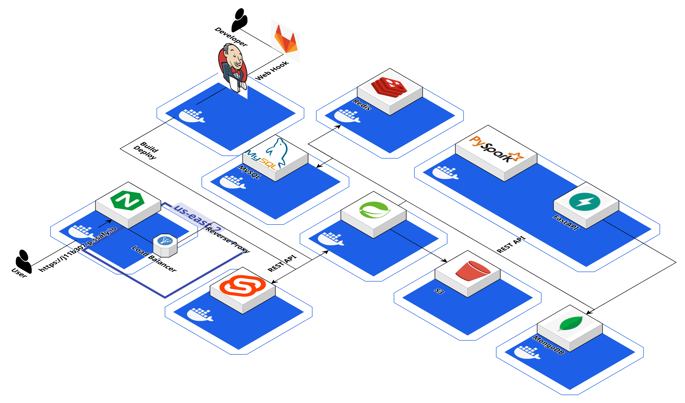

#  README

# 🌻 발걸음으로 그리는 예술, 나만의 러닝! Vincent Run Gogh

# Overview

- 취미로 러닝을 즐기는 요즘, Vincent Run Gogh는 GPS 아트로 러닝을 더 재미있게 만들어줍니다. 달리면서 나만의 그림을 완성해보세요

# Vincent Run Gogh 서비스 화면

### ■ 메인 페이지

### ■ 루트 생성 페이지

### ■ 루트 조회 페이지

### ■ 드로잉 페이지

### ■ 마이 헬스 페이지

### ■ 캘린더 페이지

### ■ 통계 페이지

### ■ 커뮤니티 페이지

# 주요 기능

### 서비스 소개

- GPS를 활용해 러닝 경로로 아트를 그리는 러닝 서비스

### 프로젝트 기능

- GPS 아트를 위한 루트 생성 서비스
    - 지도에 직접 그림을 그려 도로 기반 경로를 설정할 수 있습니다.
    - 이전에 완료된 러닝 기록을 불러와 해당 경로를 GPS 아트로 변환해 재사용할 수 있습니다.
- GPS 아트 러닝 서비스
    - 생성된 경로를 선택해 러닝을 시작하며, 러닝 중 일시정지, 재개, 완료를 선택할 수 있습니다.
    - 실시간으로 거리, 속도, 페이스를 계산하여 사용자에게 제공합니다.
- 자유 드로잉 서비스
    - 루트를 미리 설정하지 않고 자유롭게 러닝을 시작하며, 사용자의 GPS 정보가 기록됩니다.
    - 완성된 드로잉은 추후에 루트로 저장할 수 있습니다.
    - 실시간으로 거리, 속도, 페이스를 계산하여 사용자에게 제공합니다.
- 커뮤니티 서비스
    - 완성된 드로잉(GPS 아트)을 커뮤니티에 업로드하고, 다른 사용자들과 공유할 수 있습니다.
    - 드로잉에 '찜' 기능을 활용하여 마음에 드는 작품을 저장하고, 이후 루트 조회에서 쉽게 확인할 수 있습니다.
- 캘린더 서비스
    - 월별, 일별로 기록된 러닝 정보를 조회하여, 각 러닝의 속도, 거리, 시간 등을 통계로 확인할 수 있습니다.
- 활동 통계 서비스
    - 월별 누적 운동 시간, 총 거리, 걸음 수 등의 데이터를 확인하여 본인의 운동 패턴을 분석할 수 있습니다.
    - 입력된 키와 몸무게를 기반으로 BMI를 계산해 건강 상태를 모니터링할 수 있습니다.

### 개발 환경

- OS
    - Local : Windows 10
    - AWS : Ubuntu 20.04.6 LTS
- IDE
    - IntelliJ IDE 2024.1.4
    - Visual Studio Code 1.90.2
- UI / UX
    - Figma
- Database
    - MySQL workbench 8.0.38 (Windows 10)
    - MySQL 8.0.29 (Ubuntu 20.04.2 LTS)
    - redis 7.4
    - mongodb 3.1
    - AWS S3
- CI/CD
    - Jenkins

### 상세 스택

- Backend(Spring Boot)
    - JAVA - openjdk 17.0.12
    - Gradle: 8.8
    - Spring Boot: 3.3.3 (Spring Data JPA, Spring Data MongoDB, Spring Data Redis, Spring Security, Spring WebSocket)
    - Spring Mail: 3.2.2
    - Swagger: 2.2.22
    - Spring Cloud AWS: 2.2.6
    - Lombok: 1.18.34
    - QueryDSL: 5.0.0
- Backend(FastAPI)
    - FastAPI: 0.114.0
    - Pydantic: 2.9.1
    - Motor: 3.6.0
    - Odmantic: 1.0.2
    - Pyspark: 3.5.2
    - Scipy: 1.13.1
    - Uvicorn: 0.30.6
- FrontEnd(Svelte)
    - Svelte: 4.2.18
    - Vite: 5.4.1
    - TypeScript: 5.5.3
    - TailwindCSS: 3.4.11
    - Leaflet: 1.9.4
    - Svelte-chartjs: 3.1.5
    - Stompjs: 2.3.3
    - Svelte-pwa: 0.20.5

### 협업 툴

- 일정 관리 : Jira, Notion
- 이슈 및 형상 관리 : Gitlab, Git
- 커뮤니케이션 : MatterMost, KakaoTalk

### 기능 명세서

### 시스템 아키텍처

### 유저 시나리오

⬛ 회원가입  

⬛ 아트 생성  

⬛ 드로잉(러닝)  

⬛ 캘린더  

⬛ 커뮤니티  

### API 명세서

### 화면 설계서

⬛ 홈  

⬛ 회원가입  

⬛ 캘린더  

⬛ 커뮤니티  

⬛ 통계  

⬛ 드로잉 - 루트 달리기  

⬛ 드로잉 상세  

⬛ 루트 생성  

⬛ 루트 조회  

⬛ 마이헬스  

### ERD

### EC2 포트 정리

| Port | Main Server |
| --- | --- |
| 80 | Nginx HTTP 기본 포트 |
| 443 | Nginx HTTPS |
| 3306 | Mysql |
| 5173 | Svelte app |
| 6379 | Redis |
| 8080 | Spring boot |
| 9090 | Jenkins |
| Port | Sub Server |
| 80 | Nginx HTTP 기본 포트 |
| 8000 | FastAPI |
| 9090 | Jenkins |
| 27117 | Mongo Express |
| 27017 | Mongo |

### 역할 분배

