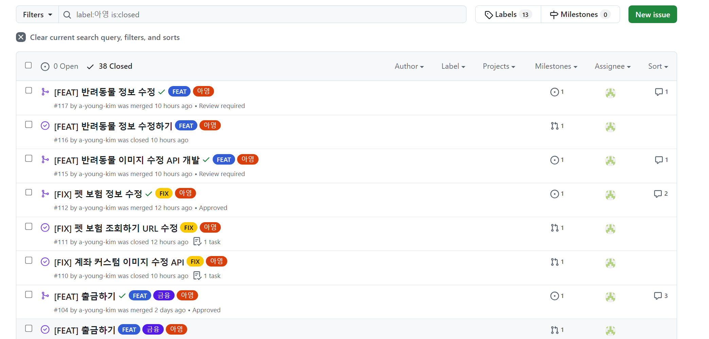
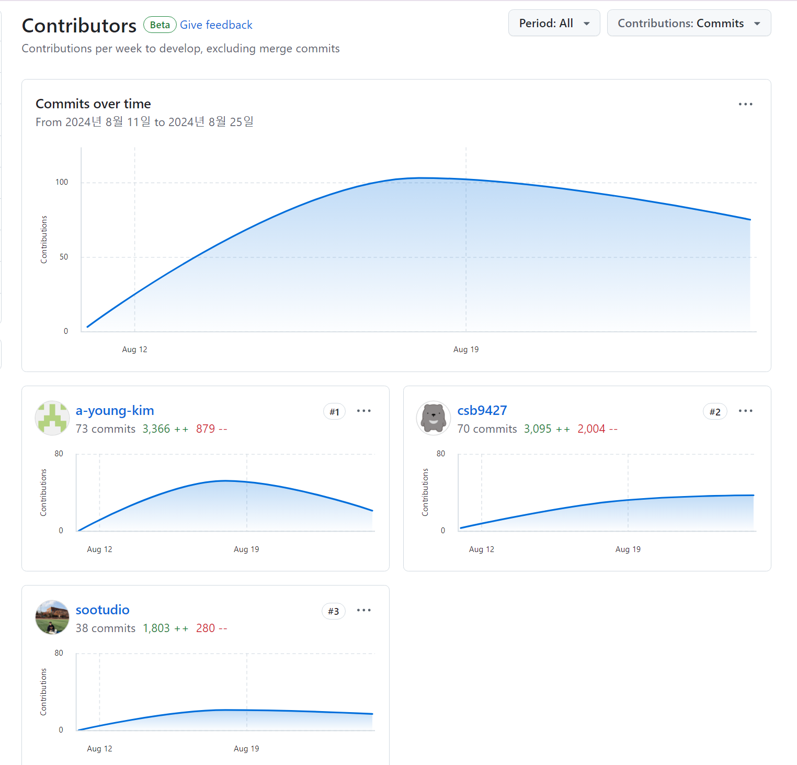

# 1주차 진행상황

## 1. 아이디어 기획

### 여행 경로 및 숙소 추천

#### 데이터
[에어비앤비](https://insideairbnb.com/get-the-data/)

- Tokyo 기준 → 약 95개의 도시
    - 숙소 상세 데이터 16518개
        - 해당 사이트 링크, 숙소 이름, 숙소 간략 설명, 업로더 정보, 숙소 위도 및 경도, 수용 가능 인원, 화장실 개수, 방 개수, 침대 개수, 편의 시설 상세 정보, 가격, 리뷰 점수, 리뷰 개수
    - 시각화에 유리한 숙소 요약 데이터 16518개
    - 리뷰 상세 데이터 624111개
    - 시각화에 유리한 리뷰 상세 데이터 624111개 → id와 date만 존재

#### 서비스
1. 유저가 자신의 여행정보 입력
    - 기간, 장소, 비행기 정보, 방문하고 싶은 장소 입력, 원하는 가격
    - 방문하고 싶은 장소는 API를 이용하여 위도, 경도 정보 데이터 수집
2. 유저가 방문하고 싶은 장소를 기준으로 반경 NKM의 군집 정보 가져오기
3. 유저 정보를 기준으로 군집에 대한 가중치 설정
    - 일단 노드 간의 거리를 가중치로 설정
    - 주변 환경에 따른 가점 부여 : 지하철과 가까운 곳의 가중치를 낮추기
    - 평균 가격 ?? 여러 지표 넣을 수 있을 듯
4. 숙소 군집과 사용자가 원하는 방문 장소들을 가지고 최소 비용 구하는 알고리즘
5. 선정된 숙소 군집에서 리뷰, 가격 등 데이터를 이용하여 사용자에게 추천하기
   
### 전국 공공자전거 실시간 현황 확인 및 경로 추천 앱

#### 데이터
[따릉이 데이터](https://data.seoul.go.kr/dataList/OA-15493/A/1/datasetView.do)
[타슈 데이터](https://www.data.go.kr/data/15119663/openapi.do)

#### 서비스
- 사용자의 위치로부터 가능한 자전거 거치소 알려주기
- 사용자가 도착지 경유지 등을 입력하면 자전거 거치소 데이터와 경로를 알고리즘을 통해 최적의 경로 추천하기

## 2. 신한 해커톤

#### 기능 구현 사항

#### 기여도
