# 시연 시나리오

---

## 용어 정리

- 아트 : 사용자가 지도에 그린 그림
- 루트 : 아트를 기반으로 도로정보를 적용한 경로
- 드로잉 : 루트를 따라 걷는 행위

---

## 로그인 & 회원가입 페이지

- 이메일을 통한 로그인 & 회원가입
- 인증 번호로 이메일 인증

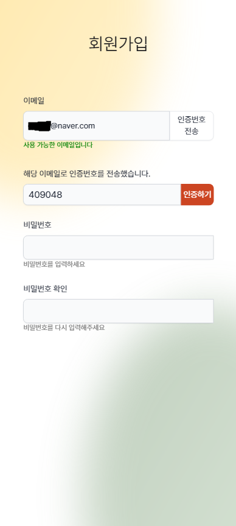

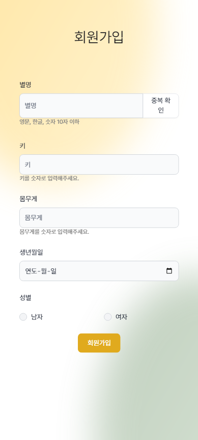

---

## 메인 페이지

- 진행 중인 드로잉과 주간 운동 정보 조회
- 커뮤니티, 드로잉 시작, 루트 생성, 마이 헬스 페이지로 이동 가능

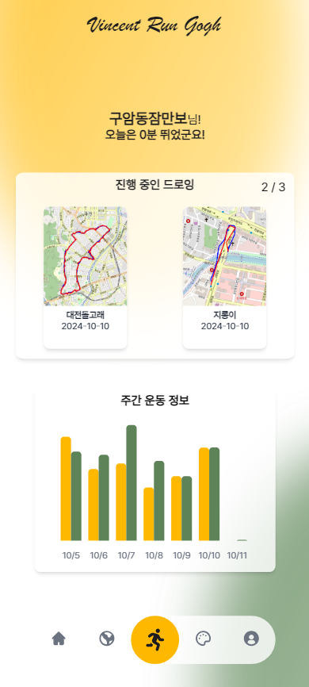

---

## 루트 생성 페이지

- 사용자가 직접 지도에 그림을 그린 후 그림을 통해 루트 생성

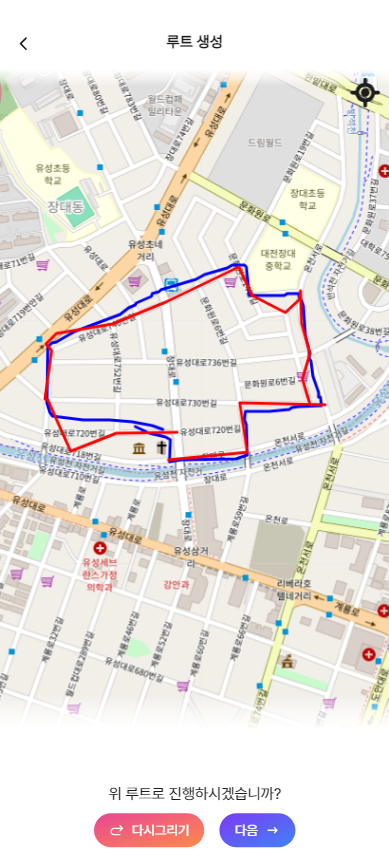

---

## 루트 조회 페이지

- 사용자가 만든 루트, 게시물 찜한 루트, 주변 루트 조회 가능
- 거리에 따른 필터 조정 가능
- 루트 선택하여 드로잉 가능

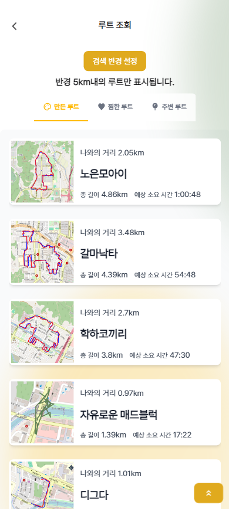

---

## 드로잉 진행 중 페이지

- 진행 중인 드로잉 시간, 총 이동 거리, 페이스, 걸음 수 조회
- 루트 드로잉의 경우 루트의 경로도 함께 출력
- 좌상단의 GPS 클릭시 현재 위치로 고정
- 빨간 손가락 클릭시 화면 잠금
- 일시 정지 시 저장, 완성, 재개 가능

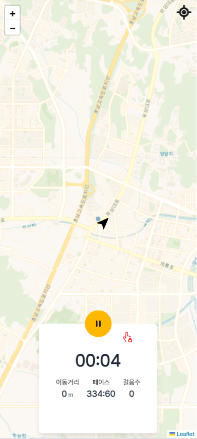

---

## 드로잉 완성 및 저장 페이지

- 드로잉 저장시 드로잉 이름 입력 후 저장
- 드로잉 저장시 이 후 다시 드로잉 시작 가능
- 드로잉 완성시 이 후 다시 드로잉 시작 불가능
- 자유 드로잉일 경우 완성만 가능

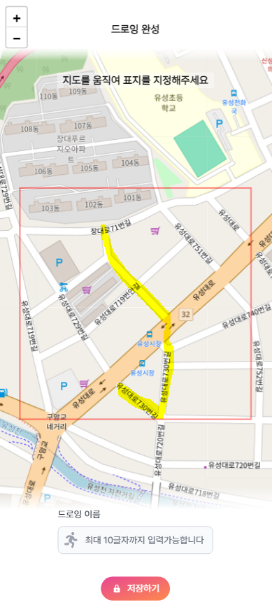

---

## 마이 헬스 페이지

- 유저 정보 수정
- BMI 조회
- 캘린더, 기록, 통계 페이지 이동 가능
- 로그아웃 가능

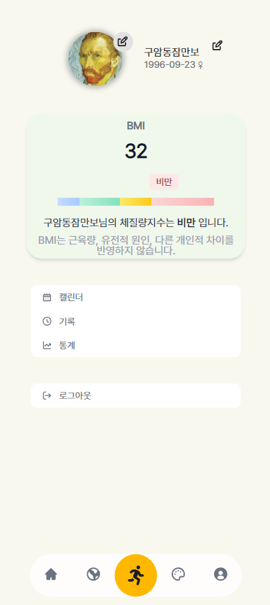

---

## 캘린더 페이지

- 월별 통계 조회
- 특정 날짜에 드로잉을 한 경우 노란색 뱃지
- 특정 날짜에 드로잉을 완성한 경우 초록색 뱃지
- 날짜 클릭시 특정 날짜에 뛴 드로잉 조회

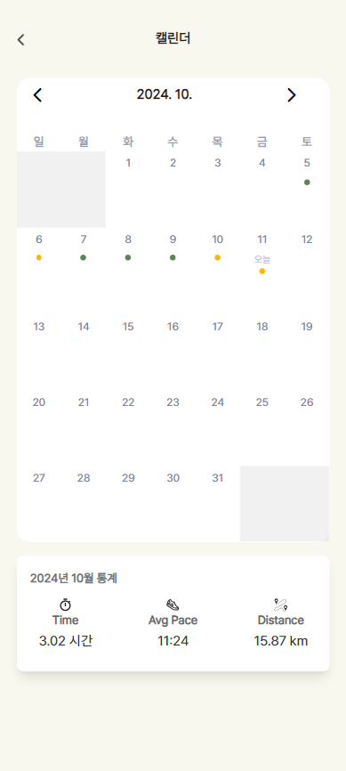

---

## 통계 페이지

- 해당 년도에 총 걸음수, 총 시간, 총 거리, 완성한 드로잉 개수 조회

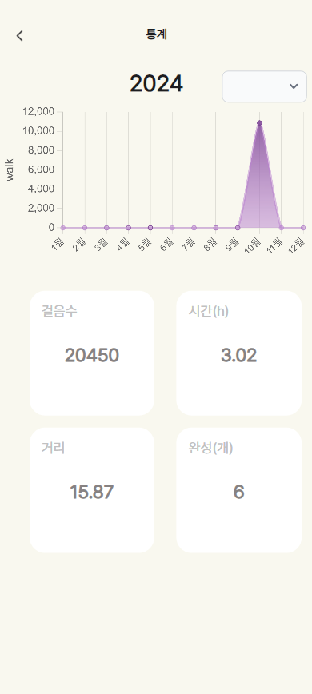

---

## 히스토리 페이지

- 사용자가 만든 루트 조회
- 사용자가 완료한 드로잉 조회

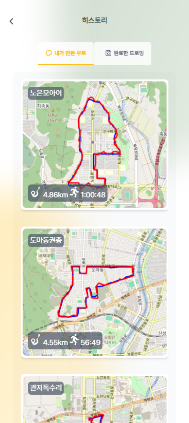

---

## 히스토리 상세

- 완료한 드로잉에 대한 총 시간, 평균 페이스, 총 거리 조회
- 루트 드로잉일 경우 아트 이미지 조회 가능
- 드로잉 상세 이미지 조회

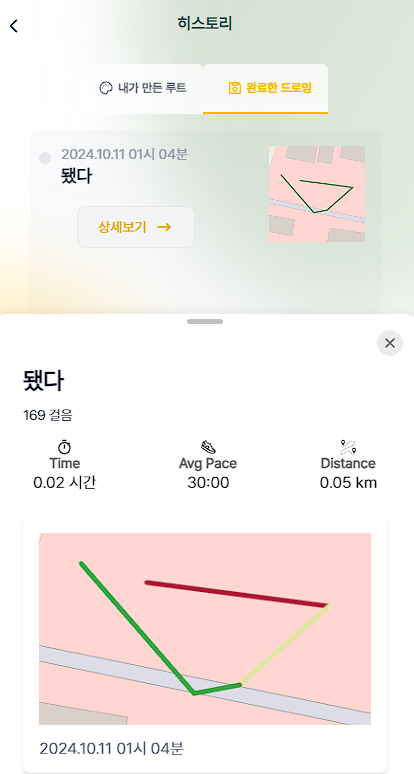

---

## 커뮤니티 페이지

- 다른 사용자가 올린 루트 조회
- 루트 찜 기능

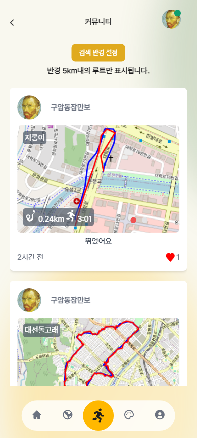

---

## 내 보관함 페이지

- 커뮤니티에 게시한 내 게시글 조회
- 내 게시글 삭제
- 좋아요를 한 타 사용자의 루트 조회
- 사용자의 완료한 드로잉(자유, 루트) 중 아직 커뮤니티에 게시하지 않은 드로잉 조회, 게시

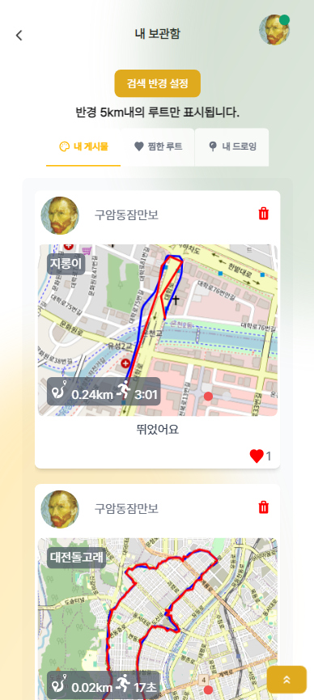